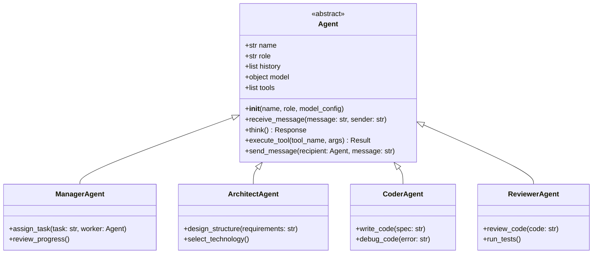
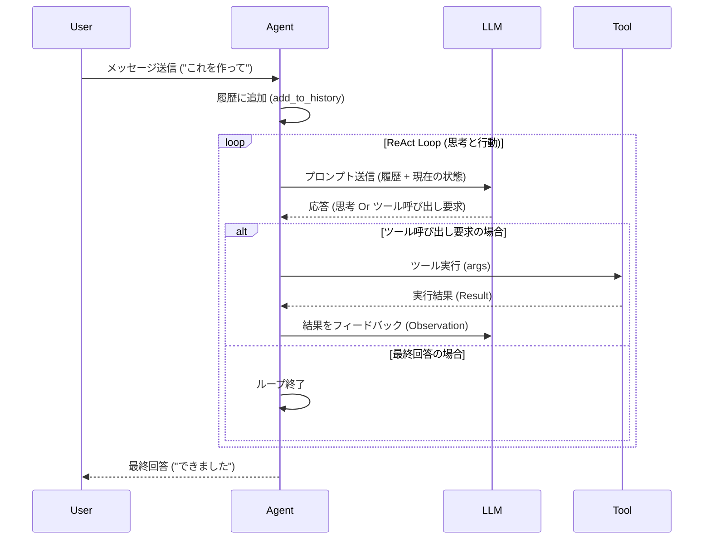
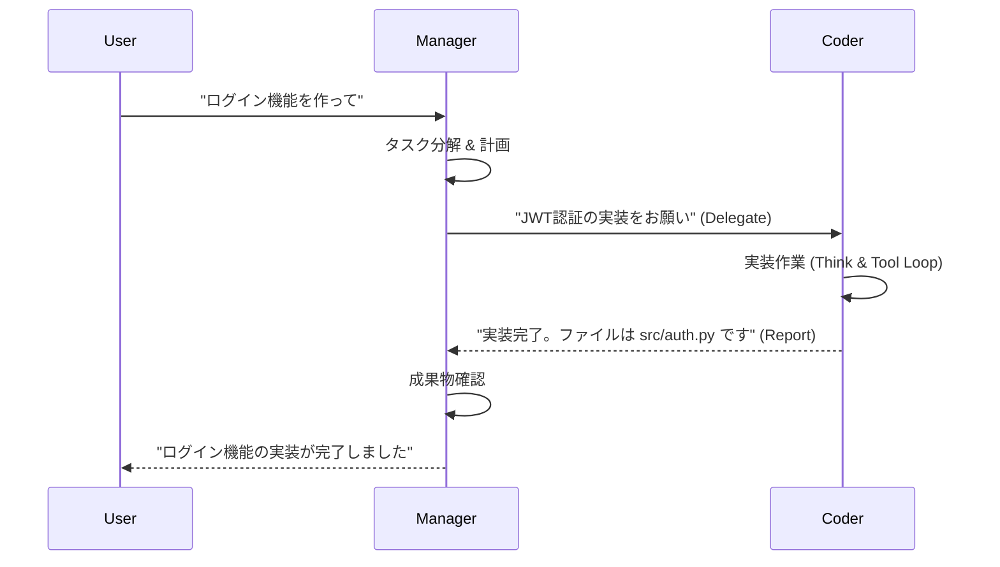

# GeminiCLI Agent Team - アーキテクチャ設計

本ドキュメントでは、自律的エージェントチームの中核となる `Agent` クラスの設計と、エージェント間のインタラクションを記述します。

## 1. クラス図 (Class Diagram)

基底クラス `Agent` を定義し、具体的な役割を持つエージェントがそれを継承します。

## 2. シーケンス図 (Sequence Diagram) - 思考とツール実行ループ

エージェントがメッセージを受け取り、思考（LLM推論）し、必要に応じてツールを実行して、最終的な回答を返すまでのフローです。

## 3. エージェント間通信 (Interaction) - タスク委譲

ManagerがタスクをCoderに委譲し、結果を受け取るフロー。

