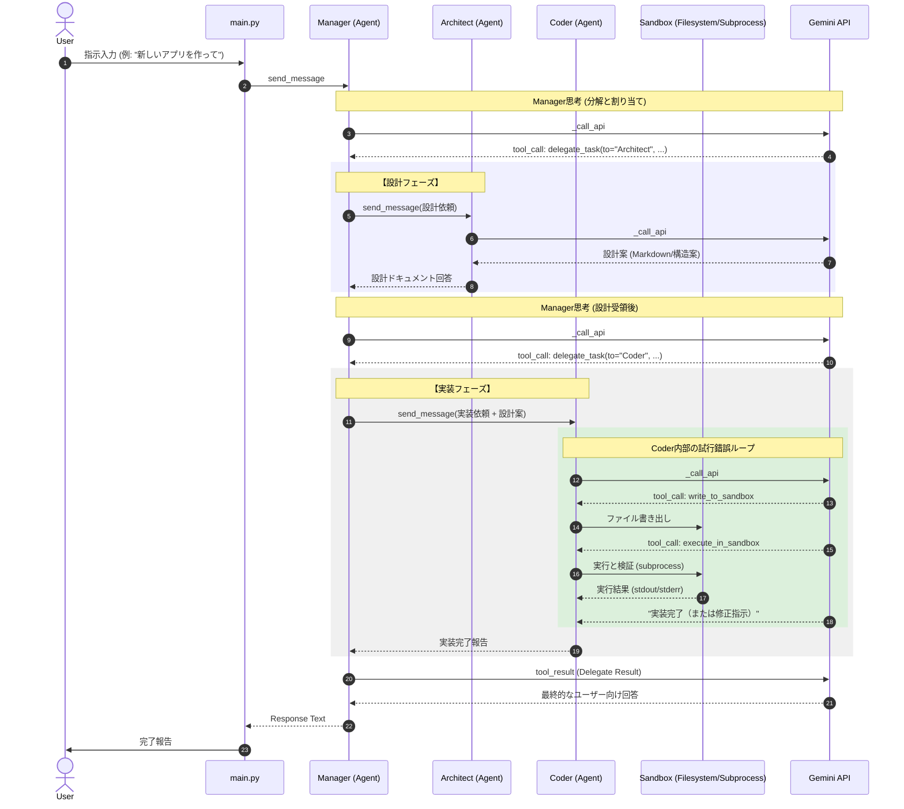

# シーケンス図: エージェント間のインタラクション（詳細）

この図は、Managerがプロジェクト全体の指揮を執り、Architectが設計を、Coderが実装と検証を行う多段的な委譲フローを示しています。

```mermaid
sequenceDiagram
    autonumber
    actor User
    participant CLI as main.py
    participant M as Manager (Agent)
    participant A as Architect (Agent)
    participant C as Coder (Agent)
    participant S as Sandbox (Filesystem/Subprocess)
    participant LLM as Gemini API

    User->>CLI: 指示入力 (例: "新しいアプリを作って")
    CLI->>M: send_message
    
    Note over M, LLM: Manager思考 (分解と割り当て)
    M->>LLM: _call_api
    LLM-->>M: tool_call: delegate_task(to="Architect", ...)
    
    rect rgb(240, 240, 255)
        Note over M, A: 【設計フェーズ】
        M->>A: send_message(設計依頼)
        A->>LLM: _call_api
        LLM-->>A: 設計案 (Markdown/構造案)
        A-->>M: 設計ドキュメント回答
    end

    Note over M, LLM: Manager思考 (設計受領後)
    M->>LLM: _call_api
    LLM-->>M: tool_call: delegate_task(to="Coder", ...)

    rect rgb(240, 240, 240)
        Note over M, C: 【実装フェーズ】
        M->>C: send_message(実装依頼 + 設計案)
        
        rect rgb(220, 240, 220)
            Note over C, LLM: Coder内部の試行錯誤ループ
            C->>LLM: _call_api
            LLM-->>C: tool_call: write_to_sandbox
            C->>S: ファイル書き出し
            LLM-->>C: tool_call: execute_in_sandbox
            C->>S: 実行と検証 (subprocess)
            S-->>C: 実行結果 (stdout/stderr)
            LLM-->>C: "実装完了（または修正指示）"
        end
        
        C-->>M: 実装完了報告
    end

    M->>LLM: tool_result (Delegate Result)
    LLM-->>M: 最終的なユーザー向け回答
    M-->>CLI: Response Text
    CLI->>User: 完了報告
```
